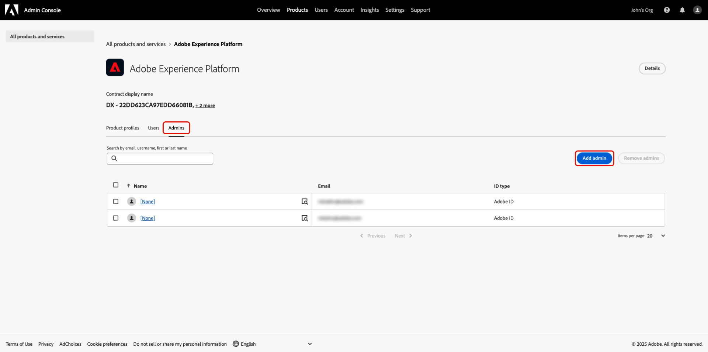
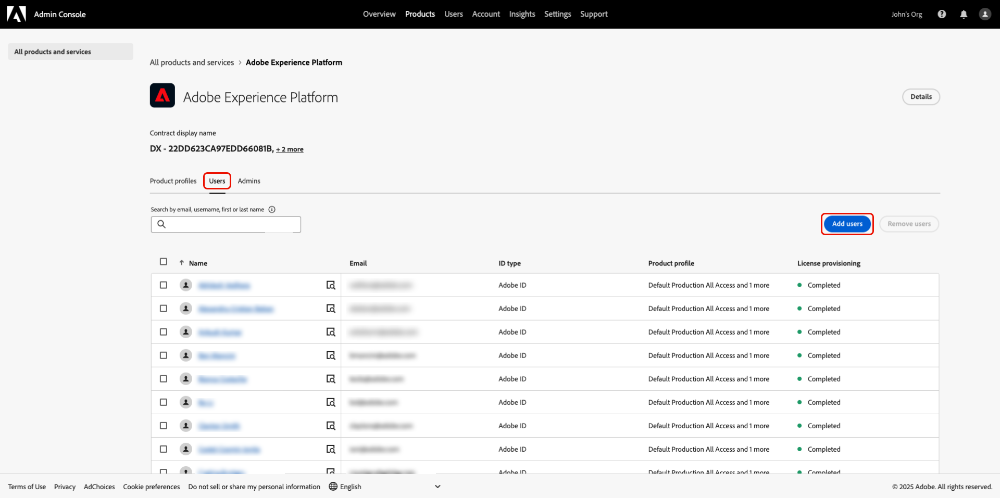

# Hantera användaråtkomst via behörigheter {#manage-user-access}

{{limited-availability-release-note}}

Hantera behörigheter och användaråtkomst till enskilda komponenter i Real-Time CDP Collaboration via gränssnittet Experience Cloud [Permissions](https://experienceleague.adobe.com/en/docs/experience-platform/access-control/abac/permissions-ui/browse){target="_blank"} . Behörigheter gör det möjligt för system- och produktadministratörer att definiera [roller](./manage-roles.md) för att hantera användaråtkomst till specifika funktioner och resurser.

## Konfigurera åtkomst till behörigheter {#permissions-access}

För att få åtkomst till behörigheter måste du ha både produktadministratörs- och användaråtkomst till Adobe Experience Platform-produkten. En systemadministratör krävs för att konfigurera produktadministratörsbehörighet, medan användarbehörigheter kan konfigureras av en system- eller produktadministratör. Mer information om administrativa roller finns i [heirarchy-guiden](./overview.md#hierarchy) för åtkomstkontroll.

>[!TIP]
>
>I den här guiden kommer en **administratör** att referera till **både system- och produktadministratörer**.

### Systemadministratörer: konfigurera åtkomst för produktadministratörer {#admin-access}

Ge en användare produktadministratör åtkomst för att ge dem administrativa funktioner i Experience Platform-produkten genom följande steg:

>[!IMPORTANT]
>
>Som systemadministratör har du direkt tillgång till specifika Experience Cloud-produkter, till exempel Adobe Admin Console. Om du vill använda behörigheter måste du ge dig själv produktadministratör och användare tillgång till Experience Platform-produkten. Följ de stegvisa instruktionerna nedan för att ge dig själv åtkomst som systemadministratör.

Logga in på [Adobe Experience Cloud](https://experience.adobe.com/){target="_blank"} med dina autentiseringsuppgifter. Hemvyn visas med en lista över dina tillgängliga produkter i avsnittet **[!UICONTROL Quick access]**. Välj **[!UICONTROL Admin Console]**.

{zoomable="yes"}

Översiktspanelen för [Adobe Admin Console](https://adminconsole.adobe.com/) visas. Välj **[!UICONTROL Adobe Experience Platform]** i listan **[!UICONTROL Products]** under **[!UICONTROL Products and services]**.

{zoomable="yes"}

Adobe Experience Platform kontrollpanel visas. Markera fliken **[!UICONTROL Admins]** och välj sedan **[!UICONTROL Add admin]**.

{zoomable="yes"}

Dialogrutan **[!UICONTROL Add product administrators]** visas. Ange användarens e-postadress eller användarnamn i textfältet **[!UICONTROL Email or username]** och välj sedan rätt konto i listrutan. Välj **[!UICONTROL Save]** om du vill lägga till användaren som produktadministratör.

{zoomable="yes"}

Användaren har nu produktadministratörsbehörighet och kan utföra administrativa funktioner, till exempel lägga till användare eller andra administratörer, i produkten i Admin Console. Därefter behöver de åtkomst till Experience Platform-produkten för att få tillgång till och utföra funktioner i behörigheterna.

### Administratörer: konfigurera användaråtkomst till Experience Platform {#user-access}

Nu när du har gett användaren produktadministratörsbehörighet måste du ge användaren åtkomst till Experience Platform-produkten. Som en del av åtkomstkonfigurationerna tilldelar du de användarspecifika [produktprofilerna](https://helpx.adobe.com/enterprise/using/manage-product-profiles.html).

>[!TIP]
>
>Om du följer med i föregående avsnitt är du redan inne i Adobe Experience Platform-produkten och du kan hoppa över det första steget.

Navigera till [Admin Console](https://adminconsole.adobe.com/){target="_blank"} och välj **[!UICONTROL Adobe Experience Platform]** från **[!UICONTROL Products]** listan under **[!UICONTROL Products and services]**.

{zoomable="yes"}

**[!UICONTROL Users]** Markera fliken och välj **[!UICONTROL Add users]** sedan.

{zoomable="yes"}

Dialogrutan **[!UICONTROL Add users to this product]** visas. Ange användarens namn eller e-postadress i textfältet **[!UICONTROL Name, user group or email address]** och välj sedan rätt konto i listrutan. Välj sedan alternativet **[!UICONTROL Products]** för att lägga till.

{zoomable="yes"}

Dialogrutan **[!UICONTROL Select product profiles]** visas. Markera **[!UICONTROL AEP-Default-All-Users]** och **[!UICONTROL Default Production All Access]** och välj sedan **[!UICONTROL Apply]**.

{zoomable="yes"}

Bekräfta att informationen är korrekt och välj **[!UICONTROL Save]** sedan.

{zoomable="yes"}

Användaren bör nu ha produktadministratörs- och produktåtkomst till Experience Platform, vilket ger dem tillgång till behörigheter. Därefter måste du tilldela användaren två grundläggande roller för att ge dem åtkomst till användargränssnittet för Experience Plaform.

### Administratörer: konfigurera åtkomst till användargränssnittet i Experience Platform {#product-access}

I Real-Time CDP Collaboration kommer administratörer och slutanvändare att arbeta med data från Experience Platform, till exempel målgrupper och granskningsloggar. Dessa data lagras i instanser av Experience Platform som kallas sandlådor. För att användare ska kunna interagera med dessa data måste du tilldela användaren [standardroller](https://experienceleague.adobe.com/en/docs/experience-platform/access-control/home#default-roles){target="_blank"}.

Börja med att navigera till [Adobe Experience Cloud](https://experience.adobe.com/). Du bör nu se **[!UICONTROL Experience Platform]** och **[!UICONTROL Permissions]** inuti **[!UICONTROL Quick access]**.

{zoomable="yes"}

>[!NOTE]
>
> Det kan ta flera minuter att få tillgång till produkterna och du får ett e-postmeddelande om att du har fått åtkomst. Om du inte ser Experience Platform eller behörigheter i Adobe Experience Cloud när du har fått e-postmeddelandet loggar du ut och sedan in på ditt konto igen.

I det här skedet kan du nu komma åt **[!UICONTROL Permissions]**. Om du försöker komma åt **[!UICONTROL Experience Platform]** får du en varning om att inga sandlådor är aktiverade, som visas nedan. För att lösa detta måste du tilldela standardrollerna till användaren. Börja genom att välja **[!UICONTROL Permissions]**.

{zoomable="yes"}

Kontrollpanelen **[!UICONTROL Permissions]** visas. Välj **Användare** i den vänstra panelen och välj sedan användarens namn.

{zoomable="yes"}

**[!UICONTROL Roles]** Markera fliken och välj **[!UICONTROL Add roles]** sedan.

{zoomable="yes"}

Dialogrutan **[!UICONTROL Add Roles]** visas. Markera **[!UICONTROL Default Production All Access]** och **[!UICONTROL Sandbox Administrators]** och välj sedan **[!UICONTROL Save]**.

{zoomable="yes"}

Nu har du tillgång till Experience Platform och behörigheter. I det sista steget ger du åtkomst till Real-Time CDP Collaboration.

### Administratörer: konfigurera åtkomst till CDP-samarbete i realtid {#RTCDP-collaboration-access}

Om du vill ge användare åtkomst till CDP-samarbete i realtid använder du ett åtkomstkontrollkoncept som kallas roller. Roller definierar den åtkomstnivå som en administratör eller användare har till [resurser](https://experienceleague.adobe.com/en/docs/experience-platform/access-control/home#permissions) i din organisation.

När du konfigurerar individuell åtkomst till CDP-samarbete i realtid tilldelar du användarnas roller som innehåller behörigheter från resursen Samarbeten. Du kan använda [guiden för att hantera roller](./manage-roles.md) för att ta reda på information om:

- de [två standardrollerna](./manage-roles.md#standard-roles) och de åtkomstnivåer de ger till Real-Time CDP Collaboration
- skapar [anpassade roller](./manage-roles.md#specific-access-roles) med Collaboration-resursen
- listan över behörigheter som ingår i resursen Samarbeten

>[!NOTE]
>
>Dessutom måste en användare tilldelas en roll som **[!UICONTROL Prod]** innehåller behörigheten i resurserna **[!UICONTROL Sandboxes]** . Båda standardrollerna innehåller den här behörigheten. Om du väljer att tilldela en användare en anpassad roll i stället för en standardroll måste du se till att en av de roller som de har tilldelats innehåller den här behörigheten.

När du har valt eller skapat en roll som omfattar den åtkomstnivå som användaren behöver måste du tilldela användaren den rollen.

#### Tilldela en roll

Du kan tilldela flera roller till en enskild användare eller tilldela flera användare till en enda roll. Det första fallet behandlades tidigare när [standardrollerna](#product-access) tilldelades för att ge en användare åtkomst till Experience Platform. I nästa steg ska du tilldela användare direkt till den valda rollen.

I **[!UICONTROL Permissions]** väljer du **[!UICONTROL Roles]** i den vänstra panelen och väljer sedan din roll i listan.

{zoomable="yes"}

Rollens detaljsida visas. **[!UICONTROL Users]** Markera fliken och välj **[!UICONTROL Add Users]** sedan.

{zoomable="yes"}

Dialogrutan **[!UICONTROL Add Users]** visas. Välj användare i listan och välj sedan **[!UICONTROL Save]**.

{zoomable="yes"}

Användaren ska nu se **[!UICONTROL RTCDP Collaboration]** som en produkt under **[!UICONTROL Quick Access]** i Experience Cloud.

## Nästa steg

Nu när användarna har tillgång till CDP-samarbete i realtid kan de börja använda produkten. Läs [översiktsguiden](../home.md) om du vill veta mer om produkten som helhet.
