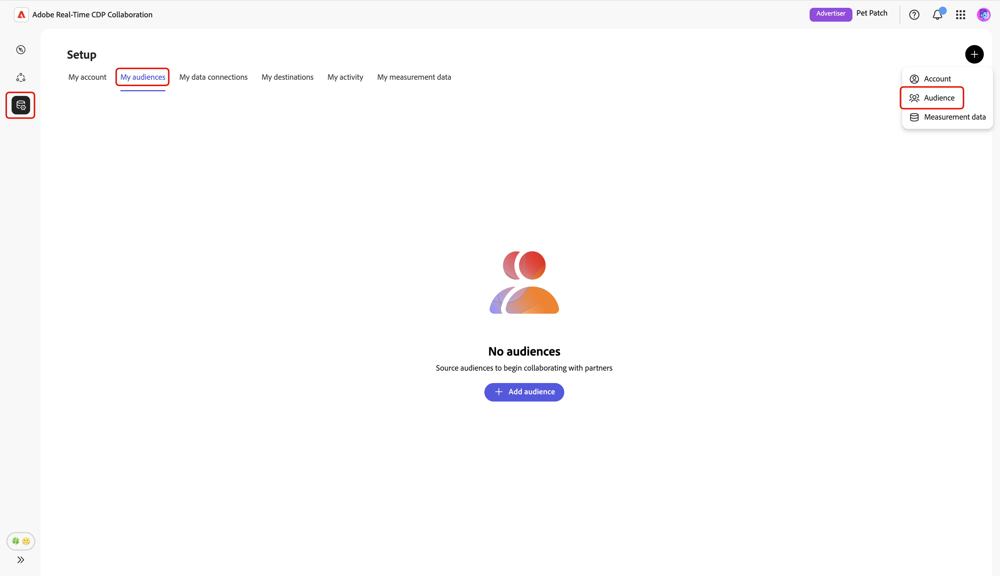
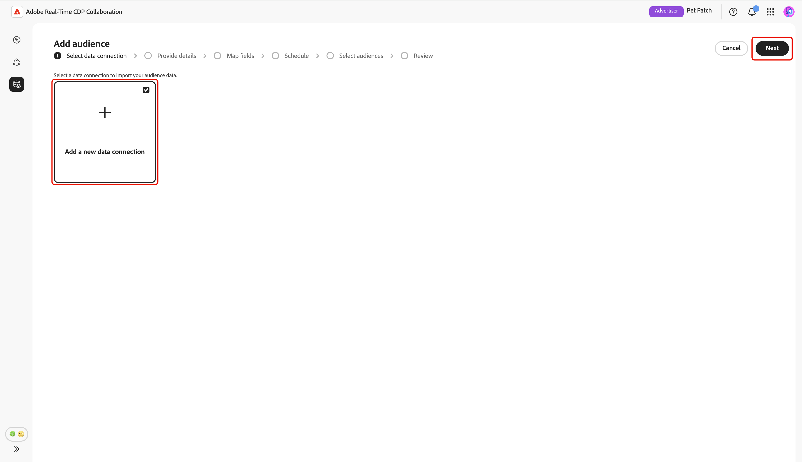

# Konfigurera [!DNL Snowflake] för målgruppskälla

Lär dig hur du konfigurerar och ansluter [!DNL Snowflake Secure Data Share] i Adobe Real-Time CDP Collaboration-gränssnittet till målgruppsdata för aktivering och överlappningsanalys.

## Översikt {#overview}

[!DNL Snowflake] är ett av de alternativ som stöds för att hämta förstahandsmålgruppsdata till Collaboration. Andra tillgängliga metoder är att hämta målgrupper från [Experience Platform](./onboard-audiences.md), ansluta en [[!DNL AWS S3] bucket](./configure-aws-s3-audience-sourcing.md) eller överföra en [CSV-fil](./upload-csv-audience-sourcing.md).

Följ stegen nedan för att ansluta din [!DNL Snowflake Secure Data Share] och hämta målgruppsdata till Collaboration. När konfigurationen är klar kan du granska, aktivera och hantera era målgrupper i era samarbetsprojekt.

## Förutsättningar {#prerequisites}

Innan du konfigurerar din [!DNL Snowflake]-anslutning kontrollerar du att du uppfyller följande krav:

* Du har skapat en [!DNL Snowflake Share] och konfigurerat de nödvändiga behörigheterna i ditt [!DNL Snowflake]-konto för att ge Adobe åtkomst till din [!DNL Snowflake Secure Data Share].
* Du har följande [!DNL Snowflake Share] värden klara:

   * **Resursnamn**
   * **Konto-ID**
   * **Schema**
   * **Visa**

* Målgruppsdata i [!DNL Snowflake Secure Data Share] måste uppfylla formatkraven som beskrivs i guiden [Målgruppsspecifikation (v1.2)](../../assets/quick-start/RTCDP_Collaboration_Audience_Sourcing_Spec_v1.2.pdf).
* Alla matchningsnycklar i målfilen [!DNL Snowflake] måste också aktiveras för ditt Collaboration-konto. Lär dig hur du [aktiverar matchningsnycklar](./onboard-account.md#set-up-match-keys) eller [lägger till nya matchningsnycklar](./onboard-account.md#edit-match-keys) i ditt konto.

## Konfigurera din [!DNL Snowflake]-anslutning {#configure-snowflake-connection}

På fliken **[!UICONTROL My audiences]** i arbetsytan **[!UICONTROL Setup]** väljer du ikonen Lägg till () och välj sedan **[!UICONTROL Audience]**.

Om det här är din första målgrupp kan du även välja alternativet **[!UICONTROL Add audience]**.

Arbetsflödet Lägg till målgrupp visas. Välj **[!UICONTROL Add a new data connection]** och sedan **[!UICONTROL Next]**.

{zoomable="yes"}

### Välj [!DNL Snowflake] som dataanslutning {#select-snowflake}

Välj sedan **[!UICONTROL Snowflake]** som dataanslutning, följt av **[!UICONTROL Next]**.

![Väljningsskärmen för dataanslutning med [!DNL Snowflake] tillgänglig som ett valbart alternativ.](../../assets/setup/snowflake-audience-sourcing/select-snowflake-data-connection.png)

### Granska målgruppsfil {#review-audience-file}

>[!CONTEXTUALHELP]
>id="rtcdp_collaboration_audience_sourcing_specifications_snowflake"
>title="Förbered data för introduktion"
>abstract="Läs guiden Audience Sourcing om hur du formaterar och strukturerar målgruppsdata från Snowflake för Collaboration."
>additional-url="https://www.adobe.com/go/rtcdp-collaboration-audience-sourcing" text="Se guiden"

En dialogruta visas där kraven för målgruppsfilen [!DNL Snowflake Share] och [!DNL Snowflake] förklaras innan du kan börja använda källkoden. Kontrollera att [!DNL Snowflake Share] har skapats med rätt resursnamn, kontoidentifierare, schema och vy. Om du vill bekräfta att målgruppsdata är korrekt formaterade och strukturerade för användning i Collaboration kan du läsa handboken för **[[!UICONTROL Audience Sourcing Specification]](../../assets/quick-start/RTCDP_Collaboration_Audience_Sourcing_Spec_v1.2.pdf)**.

När du är klar väljer du **[!UICONTROL Start onboarding]**.

![Förbered din [!DNL Snowflake Share]-dialogruta för introduktion med en länk till specifikationerna för målgruppskälla.](../../assets/setup/snowflake-audience-sourcing/prepare-snowflake-share-onboarding-dialog.png)

### Autentisera [!DNL Snowflake Share]-anslutning {#authenticate-snowflake-share-connection}

I det här steget måste du ange de [!DNL Snowflake Share]-autentiseringsuppgifter som krävs för att ansluta [!DNL Snowflake Share] till Collaboration:

| Fält | Beskrivning | Exempel |
|--------------------|-------------|------------------------------|
| Resursnamn | Namnet på din [!DNL Snowflake Share]. | `ADOBE_DATA_SHARE` |
| Kontoidentifierare | Den unika identifieraren för ditt Snowflake-konto. | `CUSTOMER_ORG.CUSTOMER_SNOWFLAKE_ACCOUNT` |
| Schema | Schemat i din [!DNL Snowflake Share] som innehåller dina målgruppsdata. | `CUSTOMER_SCHEMA` |
| Visa | Den faktiska datauppsättning som Collaboration hämtar in målgruppsdata. | `SECURE_VIEW_FOR_ADOBE` |

{style="table-layout:auto"}

När du har angett alla nödvändiga autentiseringsuppgifter väljer du **[!UICONTROL Next]**.

![Anslutningsformuläret [!DNL Snowflake Share] med fälten Delningsnamn, Kontoidentifierare, Schema och Visa ifyllda och knappen Nästa markerad.](../../assets/setup/snowflake-audience-sourcing/snowflake-authentication-credentials-form.png)

En bekräftelsedialogruta visas längst ned på nästa sida som bekräftar att din [!DNL Snowflake Share] har anslutits till Collaboration.

![En bekräftelsedialogruta bekräftar att din [!DNL Snowflake Share]-anslutning har upprättats.](../../assets/setup/snowflake-audience-sourcing/snowflake-share-connection-established.png)

### Ange namn och beskrivning {#provide-name-description}

I vyn **[!UICONTROL Provide details]** anger du ett beskrivande namn och en valfri beskrivning för dataanslutningen [!DNL Snowflake]. När du är klar väljer du **[!UICONTROL Next]**.

### Kartfält {#map-fields}

Skärmen **[!UICONTROL Mapping]** är skrivskyddad just nu. Du kan inte lägga till, ta bort eller använda omformningar. Collaboration mappar automatiskt källidentitetsfält från dina [!DNL Snowflake Share]-data till målfält baserat på **[specifikationen för målkällor (v1.2)](../../assets/quick-start/RTCDP_Collaboration_Audience_Sourcing_Spec_v1.2.pdf)**.

Bekräfta de mappade fälten visuellt och välj **[!UICONTROL Next]** för att fortsätta. Du kan också förhandsgranska exempeldata från [!DNL Snowflake Share] med alternativet **[!UICONTROL Preview source data]**.

När du väljer att förhandsgranska visas dialogrutan **[!UICONTROL [!DNL Snowflake Share] data preview]** med exempeldata i tabellformat. Granska detta och välj sedan **[!UICONTROL Close]**.

I dialogrutan ![[!DNL Snowflake Share] för förhandsgranskning av data visas exempeldata från [!DNL Snowflake Share] och alternativet Stäng markerat.](../../assets/setup/snowflake-audience-sourcing/preview-source-data.png)

<!-- NOTE: Manual mapping will be available in the future. -->
<!-- In the **[!UICONTROL Map fields]** screen, you can use the **[!UICONTROL Source field]** and **[!UICONTROL Target field]** dropdowns to update the auto-mapped fields, or include additional fields with the **[!UICONTROL Add field]** option. Once finished, select **[!UICONTROL Next]**. -->

<!--  -->

### Schemalägg uppdateringsfrekvens och datumintervall {#refresh-frequency-date-range}

I vyn **[!UICONTROL Schedule]** använder du sedan listrutan för att välja uppdateringsfrekvens mellan en och sex dagar. Använd sedan kalenderikonen för att ange start- och slutdatum för målgruppen.

>[!IMPORTANT]
>
>Om du vill hantera dina Collaboration-krediter effektivt anger du att uppdateringsfrekvensen ska matcha eller inte överskrida uppdateringsfrekvensen för dina underliggande [!DNL Snowflake]-data. Det minsta uppdateringsintervall som stöds är en gång var sjätte dag.

### Granska och slutför anslutningen {#review-and-complete}

Granska slutligen dina konfigurationsinställningar i sammanfattningsfönstret. Den här vyn innehåller en sammanfattning av följande avsnitt:

* **[!UICONTROL Data connection]**: Visar resursnamnet, kontoidentifieraren, schemat och vyn för [!DNL Snowflake Share].
* **[!UICONTROL Details]**: Visar namnet och den valfria beskrivningen av dataanslutningen så att den kan identifieras senare.
* **[!UICONTROL Mapping]**: Visar hur källfälten från målfilen mappas till målfält som används i Collaboration.
* **[!UICONTROL Schedule]**: Visar hur ofta anslutningen uppdaterar målgruppsdata och det aktiva datumintervallet för källa.

Välj pennikonen () om du behöver redigera ett avsnitt. Välj **[!UICONTROL Complete]** om du vill bekräfta alla avsnitt.

En bekräftelsedialogruta bekräftar att dataanslutningen har skapats och att målgruppsinhämtning pågår.

## Granska målgrupper från olika källor {#review-sourced-audiences}

När konfigurationen är klar börjar Collaboration hämta målgrupper från din [!DNL Snowflake Share]. Om målgruppsinhämtning pågår visas en banderoll högst upp i vyn.

>[!TIP]
>
>Målgruppskällans tid varierar beroende på storleken på dina [!DNL Snowflake]-data och den uppdateringsfrekvens du konfigurerade. Det kan ta längre tid att visa större datauppsättningar eller mindre vanliga uppdateringsscheman på arbetsytan i **[!UICONTROL My audiences]**.

När källan är klar är dina målgrupper tillgängliga på fliken **[!UICONTROL My Audiences]** med samma funktioner och information som målgrupper som kommer från Experience Platform.

I stödrastervyn eller tabellvyn väljer du ett radobjekt eller **[!UICONTROL View audience]** om du vill se en översikt över en viss målgrupp. Den visar målgruppens status, källa och dataanslutningsnamn tillsammans med detaljerade paneler för **[!UICONTROL Identities]**, **[!UICONTROL Categories]**, **[!UICONTROL Connection access]** och **[!UICONTROL Metadata visibility]**. Mer information finns i [Så här visar du en enskild målgrupp](./onboard-audiences.md#view-individual-audiences).

Använd den här vyn för att bekräfta inställningar för målgruppskonfiguration och synlighet innan du använder målgruppen i samarbetsprojekt.

## Visa din [!DNL Snowflake]-dataanslutning {#view-snowflake-connection}

Din nyligen tillagda [!DNL Snowflake]-anslutning är omedelbart tillgänglig på fliken **[!UICONTROL My data connections]**. Publiken visas som [!UICONTROL [!DNL Snowflake]].

Dataanslutningen [!DNL Snowflake] innehåller samma funktioner och information som andra målgruppsdataanslutningar. Läs mer om [hur du visar och hanterar dataanslutningar](../setup/manage-data-connection.md).

![Fliken Mina dataanslutningar visar dataanslutningen [!DNL Snowflake] med källstatusinformation.](../../assets/setup/snowflake-audience-sourcing/data-connection-tab-snowflake.png)

## Nästa steg {#next-steps}

Du har nu konfigurerat och anslutit [!DNL Snowflake] som en datakälla i Collaboration. När källan är klar kan du [skapa samarbetsprojekt](../collaborate/manage-projects.md), [aktivera målgrupper](../collaborate/activate.md), [granska överlappningar och insikter](../collaborate/measure.md) och [hantera målgruppsinställningar och synlighet](./onboard-audiences.md).

Mer information om andra metoder för målgruppskälla finns i följande dokumentation:

* [Konfigurera [!DNL Amazon S3] för målgruppskälla](./configure-aws-s3-audience-sourcing.md)
* [Source målgrupper från Experience Platform](./onboard-audiences.md)
* [Överför CSV-fil för målgruppskälla](./upload-csv-audience-sourcing.md)
