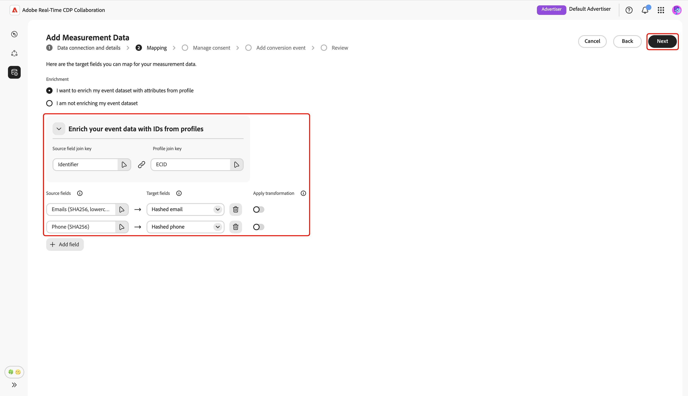
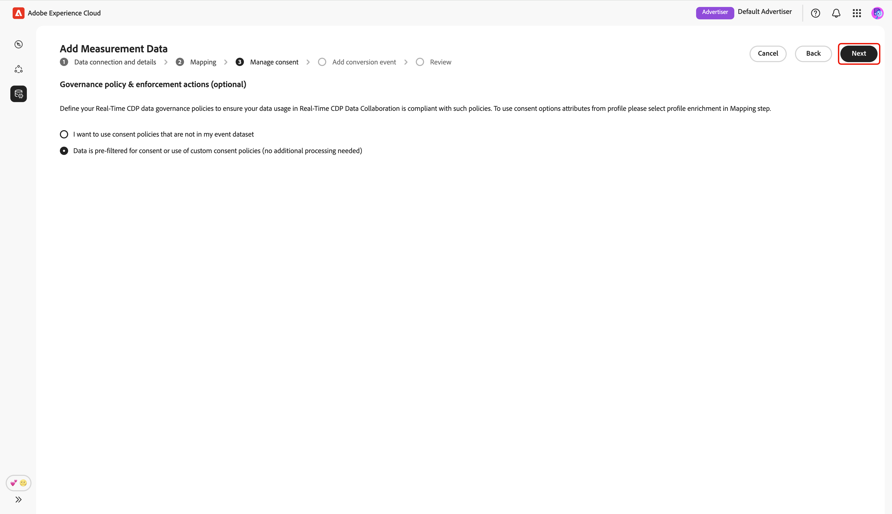

# Lägga till och hantera mätdata {#add-and-manage-measurement-data}

>[!CONTEXTUALHELP]
>id="rtcdp_collaboration_onboard_measurement_data"
>title="Läs mer"
>abstract=""

>[!CONTEXTUALHELP]
>id="rtcdp_collaboration_measurement_data_target_fields"
>title="Målfält"
>abstract="Platshållare för målfält för mätning."

>[!CONTEXTUALHELP]
>id="rtcdp_collaboration_measurement_data_source_fields"
>title="Source"
>abstract="Platshållare för mätningskällfält."

>[!CONTEXTUALHELP]
>id="rtcdp_collaboration_import_measurement_mapping_source_fields"
>title="Mappa källfält"
>abstract="Platshållare för måttmappning av källfält."

>[!CONTEXTUALHELP]
>id="rtcdp_collaboration_import_measurement_mapping_target_fields"
>title="Mappa målfält"
>abstract="Platshållare för måttmappning av målfält."

{{limited-availability-release-note}}

I det här dokumentet beskrivs stegen för hur du lägger till kampanjmätningsdata i Adobe Real-Time CDP Collaboration. Utgivare kan samarbeta med Adobe-team för att ladda upp kampanjmätningsdata. När dessa data har överförts och bearbetats kan både utgivaren och annonsören visa omfattande [kampanjmätningsrapporter](/help/guide/collaborate/measure.md).

## Lägg till mätdata {#add-measurement-data}

Som annonsörer kan du överföra mätdata som innehåller konverteringshändelser till Collaboration och använda dem i kampanjmätningsrapporter. Konverteringsdata innehåller vanligtvis fält som användaridentifierare (till exempel hashade e-post eller enhets-ID), tidsstämpel för konverteringshändelsen och specifik information om konverteringshändelser som inköp eller registrering.

Navigera till fliken **[!UICONTROL My measurement data]** på arbetsytan i **[!UICONTROL Setup]** om du vill hämta mätdata. Välj ikonen Lägg till () och välj sedan **[!UICONTROL Measurement data]**.

Om detta är dina första mätdata kan du även välja alternativet **[!UICONTROL Add]**.

{zoomable="yes"}

Skärmen **[!UICONTROL Add measurement data]** visas med en sammanfattning av steg till källmätningsdata. Välj **[!UICONTROL Start onboarding]**.

{zoomable="yes"}

### Dataanslutning och detaljer {#data-connection-and-details}

I det här steget måste du konfigurera dataanslutningen och ange information för mätdata.

#### Välj måttdatatyp {#select-measurement-data-type}

Mätdatatypen definierar vilken typ av händelser du tar med för kampanjmätning. För närvarande stöds konverteringsdata.

Välj **[!UICONTROL Conversion Data]** som måttdatatyp, följt av **[!UICONTROL Next]**.

{zoomable="yes"}

#### Välj dataanslutning {#select-data-connection}

En dataanslutning är källan som du hämtar mätdata från till Collaboration. När du har upprättat din första dataanslutning och har hämtat din första uppsättning mätdata kan du fortsätta att hämta ytterligare mätdata via samma dataanslutning.

Om du vill lägga till en dataanslutning väljer du **[!UICONTROL Add a new data connection]** och sedan **[!UICONTROL Next]**.

{zoomable="yes"}

#### Välj datakälla {#select-data-source}

Välj sedan datakälla för dataanslutningen. För närvarande är Adobe Experience Platform den enda datakälla som stöds.

Välj datakälla och välj sedan **[!UICONTROL Next]**.

{zoomable="yes"}

#### Välj sandlåda {#select-sandbox}

Välj den sandlåda som innehåller de mätdata som du vill använda för Collaboration kampanjmätningsrapporter. Välj sandlådan i listan över tillgängliga sandlådor och välj sedan **[!UICONTROL Next]**.

{zoomable="yes"}

#### Välj måttdatamängd {#select-measurement-dataset}

En lista med datauppsättningar i den valda sandlådan visas. Välj en datauppsättning som måttdata och välj sedan **[!UICONTROL Next]**. Du kan använda sökalternativet för att filtrera och hitta den önskade datauppsättningen.

{zoomable="yes"}

#### Ange namn och information {#provide-name-and-details}

Ange sedan ett namn och en beskrivning för dataanslutningen. Den här informationen hjälper dig att identifiera dataanslutningen senare.

{zoomable="yes"}

### Mappning {#mapping}

Nästa steg är att mappa fält från mätdata till motsvarande målfält som används i Collaboration. Du kan också utöka din händelsedatamängd med attribut från kundprofilen i realtid genom att mappa kopplingsnycklar och använda dessa attribut för att dela upp mätrapporter.

#### Förbättra händelsedata {#enrich-event-data}

Om du vill utöka dina händelsedata väljer du alternativet **[!UICONTROL Source field join key]**.

{zoomable="yes"}

I dialogrutan **[!UICONTROL Source field join key]** väljer du källfältet följt av **[!UICONTROL Select]**.

{zoomable="yes"}

Välj sedan alternativet **[!UICONTROL Profile join key]**. Välj profilfältet i listan i dialogrutan **[!UICONTROL Profile join key]**. Du kan använda alternativet Sök för att hitta det önskade fältet. Välj sedan **[!UICONTROL Select]** för att bekräfta.

{zoomable="yes"}

#### Mappningsfält {#mapping-fields}

Om du vill börja mappa källfält från måttdata till målfälten i Collaboration markerar du det tomma källfältet på skärmen **[!UICONTROL Mapping]**.

{zoomable="yes"}

Dialogrutan **[!UICONTROL Select source field]** visas med en lista över tillgängliga källfält grupperade under alternativ som **[!UICONTROL Identity namespace]** och **[!UICONTROL Event schema]**. Du kan använda sökalternativet för att filtrera och hitta källfältet från listan.

Välj det källfält som du vill använda, följt av **[!UICONTROL Select]**.

{zoomable="yes"}

Använd sedan listrutan för att mappa det valda källfältet till ett lämpligt målfält. Alla tillgängliga målfält är de [matchande nycklarna som konfigurerats för ditt medarbetarkonto](./onboard-account.md#set-up-match-keys).

{zoomable="yes"}

Du kan lägga till eller ta bort mappningsrader efter behov. Om du behöver mappa ett icke-hash-kodat källfält till ett hash-kodat målfält (t.ex. mappning av ett oformaterat e-postmeddelande till [!UICONTROL Hashed email]) använder du alternativet **[!UICONTROL Apply transformation]** för att tillämpa det nödvändiga hashvärdet.

När du är klar granskar du mappade fält och kopplar nycklar om anrikning är aktiverat. Välj sedan **[!UICONTROL Next]**.

{zoomable="yes"}

### Hantera samtycke {#manage-consent}

Innan du fortsätter måste du bekräfta att din dataanvändning i Collaboration överensstämmer med Real-Time CDP policyer för datastyrning. Alla uppgifter måste förfiltreras i enlighet med krav på samtycke eller andra tillämpliga regler för anpassat samtycke, så ingen ytterligare behandling krävs.

Välj **[!UICONTROL Next]** om du vill bekräfta din bekräftelse.

{zoomable="yes"}

Om du [aktiverar profilberikning under mappningssteget](#enrich-event-data) kan du konfigurera medgivandeprinciper från en lista med fördefinierade alternativ. Detta omfattar följande:

* **Marknadsföringsåtgärder**: Använd dessa marknadsföringsåtgärder för att kontrollera vilka målgruppsdata som ska hämtas till Collaboration från Experience Platform.
* **Medgivanderegler**: Välj de medgivanderegler som ska gälla för data som hämtas till Collaboration.
* **Målgrupp**: Använd målgruppsfiltret för att inkludera eller exkludera målgruppsprofiler för samtycke.

>[!NOTE]
>
>**[!UICONTROL Data Collaboration]** har stöd för dataanvändningsetiketter i C4, C5 och C9, medan **[!UICONTROL Data Science]** endast har stöd för C9. Läs mer om dataanvändningsetiketter i Experience Platform-dokumentationen:
>
>* [Översikt över etiketter för dataanvändning](https://experienceleague.adobe.com/en/docs/experience-platform/data-governance/labels/overview){target="_blank"}
>* [Ordlista](https://experienceleague.adobe.com/en/docs/experience-platform/data-governance/labels/reference){target="_blank"}

Välj önskade inställningar och välj sedan **[!UICONTROL Next]**.

{zoomable="yes"}

Innan du fortsätter måste du bekräfta och godkänna villkoren i dialogrutan **[!UICONTROL Governance policy and enforcement actions]**. Markera kryssrutan följt av **[!UICONTROL OK]**.

{zoomable="yes"}

#### Målgruppsfilter {#audience-filter}

Om du vill inkludera eller exkludera vissa målgruppsprofiler för samtycke använder du listrutan **[!UICONTROL Audience filter]**. När du har valt det här filtret uppdateras gränssnittet så att alternativet **[!UICONTROL Browse audiences]** visas. Välj **[!UICONTROL Browse audiences]**.

{zoomable="yes"}

Dialogrutan **[!UICONTROL Select audiences]** visas. Välj en målgrupp i listan följt av **[!UICONTROL Select]**.

{zoomable="yes"}

Din valda målgrupp visas nu och du kan ta bort den om det behövs. Granska dina inställningar för samtycke och välj sedan **[!UICONTROL Next]**.

{zoomable="yes"}

### Lägg till konverteringshändelse {#add-conversion-event}

Definiera sedan de konverteringshändelser som ni vill mäta effekten av era kampanjer på, till exempel webbplatsbesök, registreringar eller slutförda köp. Du kan ange upp till **3** distinkta konverteringshändelser för mätning.

Ange namnet på konverteringshändelsen och använd sedan listrutan för att välja konverteringstyp.

{zoomable="yes"}

Du kan ange ett värde för konverteringen, eller lämna det tomt om du inte vill tilldela något värde just nu.

{zoomable="yes"}

Därefter måste du ange dupliceringsnyckeln för att ange vilka rader i händelsedatamängden som tillhör samma underliggande konverteringshändelse (till exempel samma tidsstämpel under en registreringsprocess). Detta förhindrar att samma konvertering räknas flera gånger i mätrapporter. Välj **[!UICONTROL Duplication key]** om du vill göra det. I dialogrutan **[!UICONTROL Duplication key]** söker du efter och väljer nyckeln, följt av **[!UICONTROL Select]**.

{zoomable="yes"}

När du har angett dupliceringsnyckeln kan du lägga till upp till **5** villkor så att endast relevanta rader från händelsedatauppsättningen inkluderas för konverteringen. Välj om du vill använda alla eller några av dessa villkor.

Välj **[!UICONTROL Add condition]** och välj sedan villkorsalternativet.

{zoomable="yes"}

I dialogrutan **[!UICONTROL Select source field]** söker du efter och väljer ett källfält för villkorsregeln följt av **[!UICONTROL Select]**.

{zoomable="yes"}

Använd listrutan för att välja en logikoperator och ange sedan värdet för konfigurationsregeln.

{zoomable="yes"}

Välj **[!UICONTROL Add conversion]** om du vill lägga till ytterligare en konverteringshändelse. Du kan inkludera upp till **3** konverteringshändelser totalt. När du är klar granskar du konverteringskonfigurationerna och väljer **[!UICONTROL Next]**.

{zoomable="yes"}

### Granska {#review}

Skärmen **[!UICONTROL Review]** visas med en sammanfattning av måttdatainställningarna. Granska och se till att all information är korrekt. Använd alternativet **[!UICONTROL Edit]** om du behöver ändra något avsnitt.

Slutligen väljer du **[!UICONTROL Complete]** för att lägga till måttdata.

{zoomable="yes"}

En bekräftelsedialogruta bekräftar att mätdata har skapats. Du kan se de nya konverteringshändelserna som har konfigurerats utifrån dina mätdata på arbetsytan **[!UICONTROL My measurement data]**.

{zoomable="yes"}

I stödrastervyn eller tabellvyn väljer du ett radobjekt eller alternativet **[!UICONTROL View conversion]** på ett händelsekort för att visa en översikt över en specifik konverteringshändelse. Här visas händelsens status, källa och dataanslutningsnamn tillsammans med detaljerade paneler för:

* **[!UICONTROL Conversion details]**: Visar viktig information om konverteringen, inklusive dess typ, den dupliceringsnyckel som används för att identifiera unika händelser och det tilldelade konverteringsvärdet (om det anges).
* **[!UICONTROL Conditions]**: Visar de villkorsregler som används för den här konverteringshändelsen.

{zoomable="yes"}

## Nästa steg {#next-steps}

Du har slutfört inhämtningen av mätdata i Collaboration. Som annonsörer kan ni nu skapa Attribution-rapporter för att utforska hur era kampanjer driver konverteringar och mäter den övergripande effekten. Om du är utgivare ber du din samarbetspartner att generera en attribueringsrapport för dina kampanjer. Detaljerade instruktioner finns i guiden [Skapa attribueringsrapport](../collaborate/measure.md#create-attribution-report).
